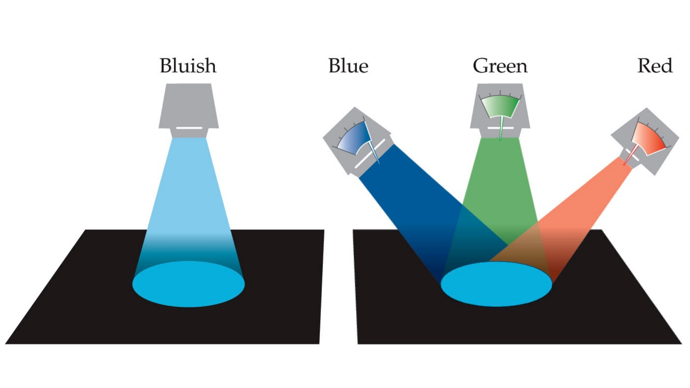

.. _conceptual-intro:

Conceptual Introduction
***********************

``plenoptic`` is a python library for "model-based synthesis of perceptual
stimuli". If you've never heard this phrase before, it may seem mysterious: what
is stimulus synthesis and what types of scientific investigation does it
facilitate?

Synthesis is a framework for exploring models by using them to create new
stimuli, rather than examining their responses to existing ones. ``plenoptic``
focuses on models of visual [#]_ information processing, which take an image as
input, perform some computations based on parameters, and return some
vector-valued abstract representation as output. This output can be mapped to
neuronal firing rate, fMRI BOLD response, behavior on some task, image category,
etc., depending on the researchers' intended question.

.. _synthesis-schematic:
.. figure:: images/model_sim-fit-infer.svg
   :figwidth: 100%
   :alt: Schematic describing relationship between simulate, fit, and synthesize.

   Schematic describing relationship between simulate, fit, and synthesize.

That is, computational models transform a stimulus :math:`s` to a response
:math:`r` (we often refer to :math:`r` as "the model's representation of
:math:`s`"), based on some model parameters :math:`\theta`. For example, a
trained neural network that classifies images has specific weights
:math:`\theta`, accepts an image :math:`s` and returns a one-hot vector
:math:`r` that specifies the image class. Another example is a linear-nonlinear
oriented filter model of a simple cell in primary visual cortex, where
:math:`\theta` defines the filter's orientation, size, and spatial frequency,
the model accepts an image :math:`s` and returns a scalar :math:`r` that
represents the neuron's firing rate.

The most common scientific uses for a model are to simulate responses or to fit
parameters, as illustrated in :numref:`synthesis-schematic`. For simulation, we hold
the parameters constant while presenting the model with inputs (e.g, photographs of dogs,
or a set of sine-wave gratings) and we run the
model to compute responses. For fitting, we use optimization to find the
parameter values that best account for the observed responses to a set of training
stimuli. In both of these cases, we are holding two of the three variables (:math:`r`, :math:`s`,
:math:`\theta`) constant while computing or estimating the third. We can do the same thing to
generate novel stimuli, :math:`s`, while holding the parameters and responses
constant. We refer to this process as **synthesis** and it facilitates the
exploration of input space to improve our understanding of a model's
representations.

This is related to a long and fruitful thread of research in vision science that
focuses on what humans cannot see, that is, the information they are insensitive
to. Perceptual metamers --- images that are physically distinct but perceptually
indistinguishable --- provide direct evidence of such information loss in visual
representations. Color metamers were instrumental in the development of the
Young-Helmholtz theory of trichromacy [Helmholtz1852]_. In this context,
metamers demonstrate that the human visual system projects the infinite
dimensionality of the physical signal to three dimensions.

To make this more concrete, let's walk through an example. Humans can see
visible light, which is electromagnetic radiation with wavelengths between 400
and 700 nanometers (nm). We often want to be able to recreate the colors in a
natural scene, such as when we take a picture. In order to do so, we can ask:
what information do we need to record in order to do so? Let's start with a
solid patch of uniform color. If we wanted to recreate the complete energy
spectra of the color, we would need to record a lot of numbers: even if we
subsampled the wavelengths so that we only recorded the energy every 5 nm, we
would need 61 numbers per color! But we know that most modern electronic screens
only use three numbers, often called RGB (red, green, and blue) --- why can we
get away with throwing away so much information? Trichromacy and color metamers
can help explain.

Researchers studying color perception arrived at a standard procedure -- the bipartite color-matching experiment -- for
constraining a model for trichromatic metamers, illustrated in :numref:`trichromacy`. An observer matches a monochromatic test
color (i.e., a light with energy at only a single wavelength) with the physical
mixture of three different monochromatic stimuli, called **primaries**. Thus,
the goal is to create two perceptually-indistinguishable stimuli (**metamers**).
Perhaps surprisingly, not only is this possible for any test
color, it is also possible for just about any selection of primaries (as long as they're within the
visible light spectrum and sufficiently different from each other). For most human observers, three
primaries are required: there are many colors that cannot be matched with only two primaries, and four yields non-unique responses.
However, there are some people, for whom two primaries are sufficient.

.. _trichromacy:

   Color matching experiment

Requiring three primaries for most people, but two for some provided a hint regarding the underlying mechanisms:
most people have cone photorecpetors from three distinct classes (generally
referred to as S, M, and L, for "short", "medium", and "long").  But some forms of color blindness arise from genetic
deviations in which only two classes are represented. Color metamers are created when cone
responses have been matched. Human cones transform colors from a
high-dimensional space (i.e., a vector describing the energy at each wavelength)
to a three-dimensional one (i.e., a vector describing how active each cone class
is). This means a large amount of wavelength information is discarded.

A worked example may help demonstrate this point more clearly. Let's match the
random light shown on the left below using the primaries shown on the right.

.. _primaries:
.. plot:: scripts/conceptual_intro.py primaries

   Left: Random light whose appearance we will match. Right: primaries.

The only way we can change the matching light is multiply those primaries by
different numbers, moving them up and down. You might look at them and wonder
how we can match the light shown on the left, with all its random wiggles. The
important point is that we **will not** match those wiggles. We will instead
match the cone activation levels, which we get by matrix multiplying our light
by the cone fundamentals, shown below.

.. plot:: scripts/conceptual_intro.py cones

   Left: the cone sensitivity curves. Right: the response of each cone class to
   the random light shown in :ref:`the previous figure <primaries>`.

With some linear algebra, we can compute another light that has very different
amounts of energy at each wavelength but identical cone responses, shown below.

.. plot:: scripts/conceptual_intro.py matched_light

If we look at the plot on the left, we can see that the two lights are very
different physically, but we can see on the right that they generate the same
cone responses and thus would be perceived identically.

In this example, the model was a simple linear system of cone responses, and
thus we can generate a metamer, a physically different input with identical
output, via some simple linear algebra. Metamers can be useful for understanding
other systems as well, because discarding information is useful: the human
visual system is discarding information at every stage of processing, not just
at the cones' absorption of light, and any computational system that seeks to
classify images must discard a lot of information about unnecessary differences
between images in the same class. However, generating metamer for other systems
gets complicated: when a system gets more complex, linear algebra no longer
suffices.

Let's consider a slightly more complex example. Human vision is very finely
detailed at the center of gaze, but gradually discards this detailed spatial
information as distance to the center of gaze increases. This phenomenon is
known as **foveation**, and can be easily seen by the difficulty in reading a
paragraph of text or recognizing a face out of the corner of your eye (see
[Lettvin1976]_ for an accessible discussion with examples). The simplest
possible model of foveation would be to average pixel intensities in windows
whose width grows linearly with distance from the center of an image, as shown
in :numref:`model-schematic`:

.. _model-schematic:
.. figure:: images/model_schematic.svg
   :figwidth: 100%
   :alt: Foveated pixel intensity model.

   The foveated pixel intensity model averages pixel values in elliptical windows that grow in size as you move away from the center of the image. It only cares about the average in these regions, not the fine details.

This model cares about the average pixel intensity in a given area, but doesn't
care how that average is reached. If the pixels in one of the ellipses above all
have a value of 0.5, if they're half 0s and half 1s, if they're randomly
distributed around 0.5 --- those are all identical, as far as the model is
concerned. A more concrete example is shown in :numref:`fov-met`:

.. _fov-met:
.. figure:: images/foveated_mets.svg
   :figwidth: 100%
   :alt: Three images, all identical as far as the foveated pixel intensity model is concerned.

   Three images that the foveated pixel intensity model considers identical. They all have the same average pixel values within the foveated elliptical regions (the red ellipse shows an example averaging region at that location), but differ greatly in their fine details.

These three images are all identical for the foveated pixel intensity model
described above (the red ellipse shows the size of the averaging region at that
location). These three images all have identical average pixel intensities in
small regions whose size grows as they move away from the center of the image.
However, like the color metamers discussed earlier, they are all very physically
different: the leftmost image is a natural image, the rightmost one has lots of
high-frequency noise, while the center one looks somewhat blurry. You might
think that, because the model only cares about average pixel intensities, you
can throw away all the fine details and the model won't notice. And you can! But
you can also add whatever kind of fine details you'd like, including random
noise --- the model is completely insensitive to them.

With relatively simple linear models like human trichromacy and the foveated
pixel intensity model, this way of thinking about models may seem unnecessary.
But it is very difficult to understand how models will perform on unexpected or
out-of-distribution data! The burgeoning literature on adversarial examples and
robustness in machine learning provides many of examples of this, such as the
addition of a small amount of noise (invisible to humans) changing the predicted
category [Szegedy2013]_ or the addition of a small elephant to a picture
completely changing detected objects' identities and boundaries
[Rosenfeld2018]_. Exploring model behavior on *all* possible inputs is
impossible --- the space of all possible images is far too vast --- but image
synthesis provides one mechanism for exploration in a targeted manner.

Furthermore, image synthesis provides a complementary method of comparing models
to the standard procedure. Generally, scientific models are evaluated on their
ability to fit data or perform a task, such as how well a model performs on
ImageNet or how closely a model tracks firing rate in some collected data.
However, many models can perform a task equally or comparably well [#]_. By
using image synthesis to explore models' representational spaces, we can gain a
fuller understanding of how models succeed and how they fail to capture the
phenomena under study.

Beyond Metamers
^^^^^^^^^^^^^^^

``plenoptic`` contains more than just metamers --- it provides a set of methods
for performing image synthesis. Each method allows for different exploration of
a model's representational space:

- `Metamers <tutorials/intro/06_Metamer.nblink>`_ investigate what features the model
  disregards entirely.
- `Eigendistortions <tutorials/intro/02_Eigendistortions.nblink>`_ investigates which
  features the model considers the least and which it considers the most
  important
- `Maximal differentiation (MAD) competition
  <tutorials/intro/07_MAD_Competition.nblink>`_ enables efficient comparison of two
  metrics, highlighting the aspects in which their sensitivities differ.

The goal of this package is to facilitate model exploration and understanding.
We hope that providing these tools helps tighten the model-experiment loop: when
a model is proposed, whether by importing from a related field or
earlier experiments, ``plenoptic`` enables scientists to make targeted
exploration of the model's representational space, generating stimuli that will
provide the most information. We hope to help theorists become more active
participants in directing future experiments by efficiently finding new
predictions to test.

.. [#] These methods also work with auditory models, such as in `Feather et al.,
       2019
       <https://proceedings.neurips.cc/paper_files/paper/2019/hash/ac27b77292582bc293a51055bfc994ee-Abstract.html>`_
       though we haven't yet implemented examples. If you're interested, please
       post in `Discussions
       <https://github.com/plenoptic-org/plenoptic/discussions)>`_!
.. [#] for example, as of February 2022, more than 100 models have above 95% top
  5 accuracy on ImageNet, with 9 models within a percent of the top performer at
  99.02%. Furthermore, the state of the art top 5 accuracy has been at or above
  95% since 2016, with an improvement of only 4% in the past six years.

.. [Helmholtz1852] Helmholtz, H. (1852). LXXXI. on the theory of compound
   colours. The London, Edinburgh, and Dublin Philosophical Magazine and Journal
   of Science, 4(28), 519–534. https://dx.doi.org/10.1080/14786445208647175
.. [Lettvin1976] Lettvin, J. Y. (1976). On Seeing Sidelong. The Sciences, 16(4),
   10–20.
   https://web.archive.org/web/20221016220044/https://jerome.lettvin.com/jerome/OnSeeingSidelong.pdf
.. [Szegedy2013] Szegedy, C., Zaremba, W., Sutskever, I., Bruna, J., Erhan, D.,
   Goodfellow, I., & Fergus, R. (2013). Intriguing properties of neural
   networks. https://arxiv.org/abs/1312.6199
.. [Rosenfeld2018] Rosenfeld, A., Zemel, R., & Tsotsos, J.~K. (2018). The
   elephant in the room. https://arxiv.org/abs/1808.03305
